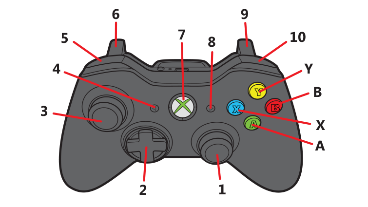

# Gamepad Button Functions

## Gamepad 1:
| Button | Function                                           | Combinations                                  | Comments                                      |
|--------|----------------------------------------------------|-----------------------------------------------|-----------------------------------------------|
| 1      | left/right rotation of the robot                   |                                               |                                               |
| 2      |                                                    |                                               |                                               |
| 3      | forward/backward/left/right movement of the robot  |                                               |                                               |
| 4      |                                                    |                                               |                                               |
| 5      |                                                    |                                               |                                               |
| 6      | Slow down robot (33% speed when fully pushed down) | `6 + 9`: Cancels each other out (66% speed)   | The further you push it down, the more it slows the robot down |
| 7      |                                                    |                                               |                                               |
| 8      |                                                    |                                               |                                               |
| 9      | Speed up the robot (100% speed when fully pushed down) | `6 + 9`: Cancels each other out (66% speed) | The further you push it down, the more it speeds the robot up |
| 10     |                                                    |                                               |                                               |
| A      | Align under the buckets                            |                                               | Does not handle rotation (yet)                |
| B      |                                                    |                                               |                                               |
| X      |                                                    |                                               |                                               |
| Y      |                                                    |                                               |                                               |

# Gamepad 2:
| Button | Function                                      | Combinations | Comments                             |
|--------|-----------------------------------------------|--------------|--------------------------------------|
| 1      | y-axis: extend/retract arm; x-axis: pivot elbow |              |                                      |
| 2      | raises/lowers both lifts                      |              |                                      |
| 3      | y-axis: raise/lower left lift; x-axis: pivot wrist |              | raises the right lift when pushed in |
| 4      |                                               |              |                                      |
| 5      | dump bucket                                   |              |                                      |
| 6      | intake out                                    |              |                                      |
| 7      |                                               |              |                                      |
| 8      |                                               |              |                                      |
| 9      | intake in                                     |              |                                      |
| 10     |                                               |              |                                      |
| A      | pivot intake down                             |              |                                      |
| B      | pivot intake to bucket                        |              |                                      |
| X      |                                               |              |                                      |
| Y      | pivot intake to neutral position              |              |                                      |
