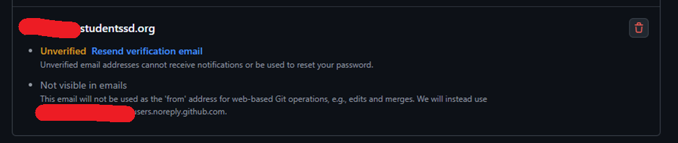
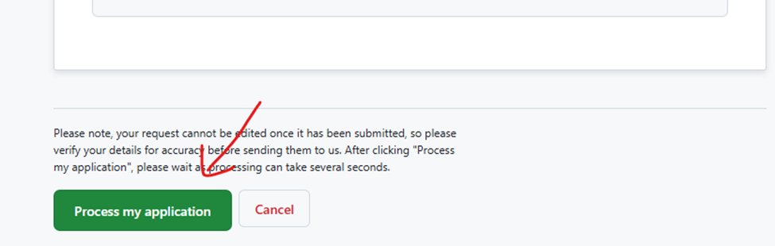

# Applying for Free Github Educational Benefits
This guide will walk you through the steps to apply for free Github Educational benefits.  This will enable FTC teams to leverage:
* Github codespaces, for easier development environment setup
* Github actions, for building and deploying their code even if hosted in a private repo
* Github Chat/CoPilot, for coding assistance.

## Step 1: Obtain a Free Github account
You must have a free Github account in order to apply for Github Educational benefits.

To sign up for an account, follow the instructions at the 
[GitHub Signup page](https://github.com/signup) 

## Step 2: Update your billing contact information in settings
You need to provide contact information in your Github account's billing information screen in order to successfully apply for Github Educational benefits.  If you don't do this, the application will be rejected.  Note: You do not need to provide any form of Payment; they just want contact information.

You can provide that information here:
https://github.com/settings/billing/payment_information

## Step 3: Apply for Educational Beneifts
Naviagte to the [GitHub Education site](https://github.com/education) and click on the Join GitHub Education button.

You may need to sign in with the GitHub account created in Step 1.

Select the  "Student" radio button if it isn't already selected:

Scroll down to the Application and search for the name of your school:

You will be asked to associate your school email account to your GitHub account.  If so, click the “add and verify your school-issued email address” link:

Add your school email:

The email will initially show as unverified.  Check your school email for an email from GitHub and click the “Verify email address” button in that email:

You should recieve an email in your school email from GitHub.  Click the "Verify email address" button.

It will try to sign you in.   You may need to enter your GitHub credentials again.  Once signed in, you should see this:

Next, upload proof of your academic status:

Click “Upload a photo” and select a photo of your student id or some other form of proof:

After uploading your photo click “Process my application”

You’ll see a progress bar…

… followed by this message when done:

You should get an email from GitHub indicating that they've recieved your application.

## Step 4: Wait

You can check on the status at the [[GitHub Education site](https://github.com/education).

After you see that the request has been approved, it can take up to 3 days before you have access to the additional benefits.

https://github.com/orgs/community/discussions/111352#user-content-how-long-after-ive-been-approved-will-i-receive-my-academic-benefits 

